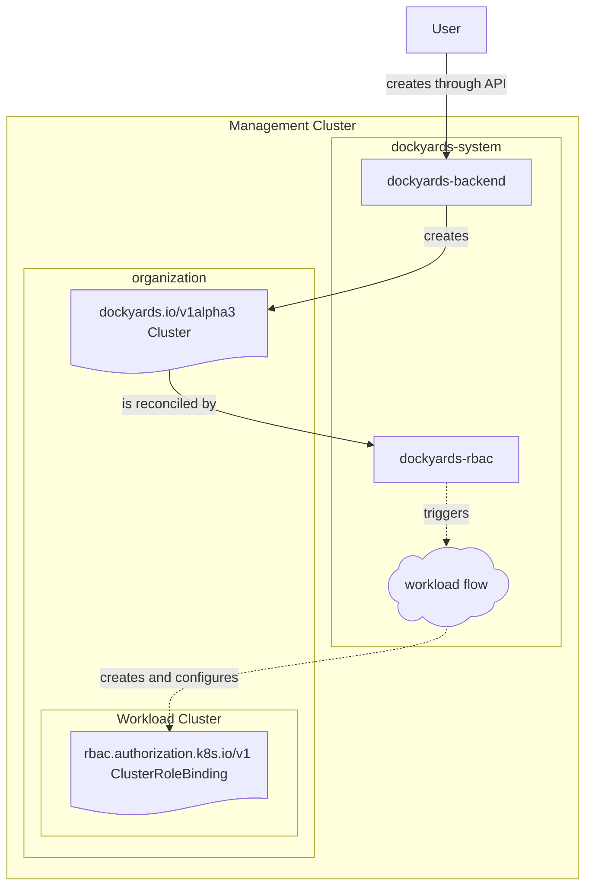

# Dockyards RBAC Operator

## Component diagram

## Purpose and responsibilities
- The controller watches every `dockyards.io/v1alpha3 Cluster` that the backend creates and, for each non-terminated cluster that belongs to an organization, it provisions a companion `Workload` in the cluster namespace.
- The generated workload is tagged as a cluster component, targets `kube-system`, and points to the shared `WorkloadTemplate` named `rbac` in the public namespace (configured via `publicNamespace`).
- The template input is tightly coupled to the `RolePrefix` reader/editor/admin groups so the ensuing Flux reconciliation creates consistent `ClusterRoleBinding`s for the Dockyards reader (`view`), editor (`edit`), and admin (`admin`) personas.

## Flow details
- **User request** – Operators create clusters through the Dockyards backend API; the backend persists the new `Cluster` CRD and stores its owner organization.
- **Cluster reconciliation** – `dockyards-rbac` is notified via controller-runtime watches, validates that the cluster has an owner, and then creates or patches the RBAC workload described above.
- **WorkloadFlow** – The mermaid node is a shortcut for the real Flux-based chain described in `../dockyards-flux2/README.md`. After `dockyards-rbac` writes the workload, the Flux stack in that repository renders the corresonding `Workload`, `Worktree`, `GitRepository`, `HelmRelease`, and `Kustomization` resources and lets Flux drive them into the target namespaces so the `ClusterRoleBinding`s materialize.

## Working with dockyards-rbac

### Deployment
- Apply `config/base/kustomization.yaml` into your management cluster just like any other controller. It creates the service account, RBAC, and deployment that runs the reconciler.

### Local development and testing
- Build or run the controller with the Go toolchain (for example, `go build ./...` or `go test ./...` from `dockyards-rbac`).
- When executing locally, inject the same configuration that the controller expects in production: `publicNamespace` must point to the namespace holding the shared `WorkloadTemplate` (usually `dockyards-public`).

### Configuration
- The controller reads configuration through the Dockyards `ConfigManager`. The only required key for RBAC is `publicNamespace`; if it is missing the reconciler aborts with an error. You can supply overrides via the same config maps or command-line flags the other Dockyards controllers use.

### Observability and verification
- Watch for workload creation with `kubectl get workloads -n <cluster-namespace>` and verify the generated `Workload` object references the `rbac` template and the expected input JSON.
- Inspect the downstream `ClusterRoleBinding`s in each workload cluster (`kubectl get clusterrolebindings dockyards:reader` etc) once Flux2 applies the template. Their subjects should match the `dockyards:` prefixed groups defined in the controller.
- Logs and metrics follow the controller-runtime conventions; tail the deployment logs in `dockyards-system` if a cluster fails to reconcile.

### Where to look next
- For the comprehensive sequence of flux resources that run after `dockyards-rbac` writes the `Workload`, read the `dockyards-flux2/README.md` component diagram and overview. It describes how Flux syncs the workload templates, Git repositories, and Flux primitives that eventually create the `ClusterRoleBinding`s shown in this diagram.
